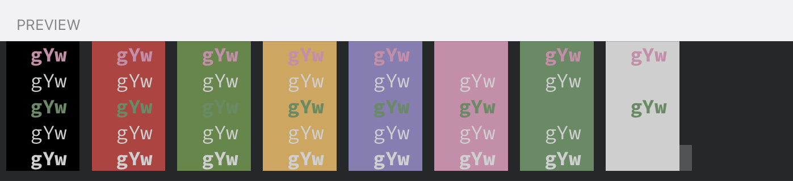

# Seoul256 Blink

> Based on [Seoul 256 for iTerm2](https://github.com/junegunn/seoul256-iTerm2) for [Blink Shell](http://www.blink.sh)

## Screenshots

## How to install

- Install [Blink Shell](https://apps.apple.com/app/id1156707581) on your iOS Device.
- Enter `config` to turn on the configuration window.
- Just paste the URL of the JS theme under `Appearance` > `Themes` > `New Theme`.
https://raw.githubusercontent.com/ekammerloher/seoul256-blink/main/seoul256.js
